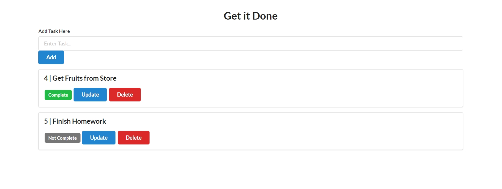
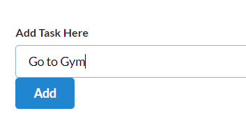
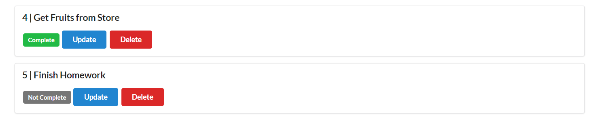
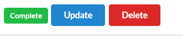

# Flask Todo-WebApp

A simple TODO application built using Python Flask and SQLAlchemy. The app allows users to add, update, mark tasks as complete/incomplete, and delete tasks. The frontend is styled using Semantic UI for a clean and modern look.

## Features

- **Add Task**: Users can add a new task by entering the task description and clicking the "Add" button.
- **Update Task**: Users can update the task description.
- **Complete Task**: Users can mark a task as complete or incomplete using the "Complete" button.
- **Delete Task**: Users can delete a task using the "Delete" button.

## Screenshots

### Overview


### Add Task


### Task List


### Task Options


## Installation

1. Clone the repository:
    ```sh
    git clone https://github.com/yourusername/flask-todo-app.git
    cd flask-todo-app
    ```

2. Create and activate a virtual environment:
    ```sh
    python -m venv venv
    source venv/bin/activate  # On Windows, use `venv\Scripts\activate`
    ```

3. Install the required packages:
    ```sh
    pip install -r requirements.txt
    ```

4. Set up the database:
    ```sh
    flask db init
    flask db migrate -m "Initial migration."
    flask db upgrade
    ```

5. Run the application:
    ```sh
    flask run
    ```

## Usage

1. Open your web browser and go to `http://127.0.0.1:5000`.
2. Add a new task using the input field and "Add" button.
3. Use the "Complete", "Update", and "Delete" buttons to manage your tasks.

## Technologies Used

- **Backend**: Flask, SQLAlchemy
- **Frontend**: Semantic UI
- **Database**: SQLite (default, can be configured to use other databases)


## Contributing

Feel free to submit issues or pull requests if you have any suggestions or improvements.


